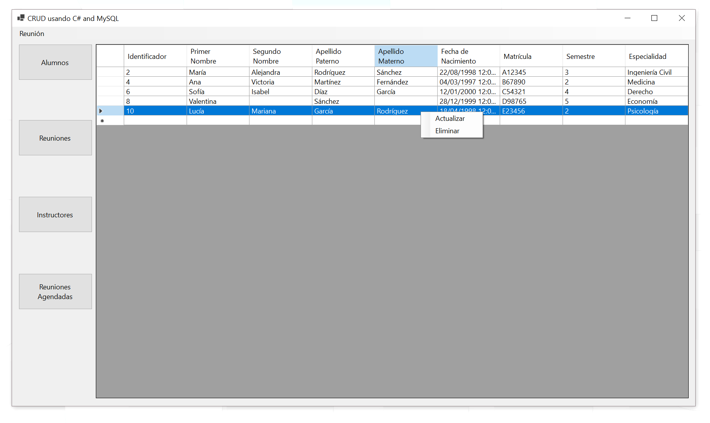

# CRUD en C# y MySQL



Este es un test sencillo de un CRUD en lenguaje C# y usando MySQL para la base de datos.
El software fue desarrollado en Microsoft Visual Studio Community 2022 y MariaDB 10.4.28.

El botón **Alumnos** muestra la unión entre la tabla `alumno` y `persona`. El botón **Instructores** muestra la unión entre la tabla `instructor` y `persona`. La tabla `persona` contiene los datos comunes para una persona, como sus nombres y apellidos.
La tabla `alumno` contiene los datos que solo un alumno tiene, como número de control y/o matrícula. La tabla `instructor` contiene los datos que solo un instructor(o profesor) tiene, como folio y/o número de empleado.

El botón **Reuniones** muestra todas las reuniones en la tabla `reunion`. El botón **Reuniones Agendadas** muestra la unión entre las tablas `persona`, `alumno`, `alumno_reunion` y `reunion`.
<details>
<summary>Dependencias</summary>
  Se requiere de las siguientes dependencias:
  
  - MaterialDesignThemes (4.9.0)
  - MaterialSkin.2 (2.3.1)
</details>

<details>
<summary>Base de datos</summary>

  ```sql
  CREATE DATABASE `practica_java`;

USE `practica_java`;

CREATE TABLE `alumno` (
  `id_persona` int UNSIGNED NOT NULL,
  `matricula` varchar(64) NOT NULL,
  `semestre` varchar(64) NOT NULL,
  `especialidad` varchar(64) NOT NULL
);

INSERT INTO `alumno` (`id_persona`, `matricula`, `semestre`, `especialidad`) VALUES
(2, 'A12345', '3', 'Ingeniería Civil'),
(4, 'B67890', '2', 'Medicina'),
(6, 'C54321', '4', 'Derecho'),
(8, 'D98765', '5', 'Economía'),
(10, 'E23456', '2', 'Psicología');

CREATE TABLE `alumno_reunion` (
  `id_alumno` int UNSIGNED NOT NULL,
  `id_reunion` int UNSIGNED NOT NULL
);

INSERT INTO `alumno_reunion` (`id_alumno`, `id_reunion`) VALUES
(2, 1),
(4, 2),
(6, 3),
(8, 4);

CREATE TABLE `instructor` (
  `id_persona` int UNSIGNED NOT NULL,
  `folio` varchar(64) NOT NULL
);

INSERT INTO `instructor` (`id_persona`, `folio`) VALUES
(1, 'F101'),
(3, 'G202'),
(5, 'H303'),
(7, 'I404'),
(9, 'J505');

CREATE TABLE `instructor_reunion` (
  `id_instructor` int UNSIGNED NOT NULL,
  `id_reunion` int UNSIGNED NOT NULL
);

INSERT INTO `instructor_reunion` (`id_instructor`, `id_reunion`) VALUES
(1, 1),
(3, 2),
(5, 3),
(7, 4),
(9, 5);

CREATE TABLE `persona` (
  `id_persona` int UNSIGNED NOT NULL,
  `nombre_uno` varchar(64) NOT NULL,
  `nombre_dos` varchar(64) DEFAULT NULL,
  `apellido_uno` varchar(64) NOT NULL,
  `apellido_dos` varchar(64) DEFAULT NULL,
  `D_nacimiento` date NOT NULL,
  `tipo_rol` varchar(30) NOT NULL
);

INSERT INTO `persona` (`id_persona`, `nombre_uno`, `nombre_dos`, `apellido_uno`, `apellido_dos`, `D_nacimiento`, `tipo_rol`) VALUES
(1, 'Juan', 'Carlos', 'Pérez', 'García', '1995-05-15', 'Instructor'),
(2, 'María', 'Alejandra', 'Rodríguez', 'Sánchez', '1998-08-22', 'Alumno'),
(3, 'Luis', 'Manuel', 'González', 'López', '1993-11-10', 'Instructor'),
(4, 'Ana', 'Victoria', 'Martínez', 'Fernández', '1997-03-04', 'Alumno'),
(5, 'Daniel', NULL, 'Torres', NULL, '1994-09-20', 'Instructor'),
(6, 'Sofía', 'Isabel', 'Díaz', 'García', '2000-01-12', 'Alumno'),
(7, 'Diego', 'Alejandro', 'Ramírez', 'Rodríguez', '1996-07-08', 'Instructor'),
(8, 'Valentina', NULL, 'Sánchez', NULL, '1999-12-28', 'Alumno'),
(9, 'Manuel', NULL, 'Pérez', NULL, '1992-06-25', 'Instructor'),
(10, 'Lucía', 'Mariana', 'García', 'Rodríguez', '1998-04-18', 'Alumno');

CREATE TABLE `reunion` (
  `id_reunion` int UNSIGNED NOT NULL,
  `fecha` date NOT NULL,
  `hora` time NOT NULL,
  `lugar` varchar(100) NOT NULL,
  `tema` varchar(200) NOT NULL
);

INSERT INTO `reunion` (`id_reunion`, `fecha`, `hora`, `lugar`, `tema`) VALUES
(1, '2023-08-20', '15:00:00', 'Sala A', 'Presentación Curso'),
(2, '2023-08-25', '14:30:00', 'Auditorio B', 'Evaluación Parcial'),
(3, '2023-09-05', '17:00:00', 'Salón C', 'Discusión Proyecto'),
(4, '2023-09-10', '16:15:00', 'Aula D', 'Taller de Debate'),
(5, '2023-09-15', '18:30:00', 'Patio Principal', 'Conferencia Invitado'),
(6, '2023-09-21', '10:00:00', 'Sala A', 'Evaluación Parcial'),
(7, '2023-09-21', '13:00:00', 'Campus Este', 'Dual'),
(8, '2023-09-22', '13:00:00', 'Campus Oeste', 'Dual');

ALTER TABLE `alumno`
  ADD PRIMARY KEY (`id_persona`);

ALTER TABLE `alumno_reunion`
  ADD PRIMARY KEY (`id_alumno`,`id_reunion`),
  ADD KEY `id_reunion` (`id_reunion`);

ALTER TABLE `instructor`
  ADD PRIMARY KEY (`id_persona`);

ALTER TABLE `instructor_reunion`
  ADD PRIMARY KEY (`id_instructor`,`id_reunion`),
  ADD KEY `id_reunion` (`id_reunion`);

ALTER TABLE `persona`
  ADD PRIMARY KEY (`id_persona`);

ALTER TABLE `reunion`
  ADD PRIMARY KEY (`id_reunion`);

ALTER TABLE `persona`
  MODIFY `id_persona` int UNSIGNED NOT NULL AUTO_INCREMENT, AUTO_INCREMENT=11;

ALTER TABLE `reunion`
  MODIFY `id_reunion` int UNSIGNED NOT NULL AUTO_INCREMENT, AUTO_INCREMENT=9;

ALTER TABLE `alumno`
  ADD CONSTRAINT `alumno_ibfk_1` FOREIGN KEY (`id_persona`) REFERENCES `persona` (`id_persona`) ON DELETE CASCADE;

ALTER TABLE `alumno_reunion`
  ADD CONSTRAINT `alumno_reunion_ibfk_1` FOREIGN KEY (`id_alumno`) REFERENCES `alumno` (`id_persona`) ON DELETE CASCADE,
  ADD CONSTRAINT `alumno_reunion_ibfk_2` FOREIGN KEY (`id_reunion`) REFERENCES `reunion` (`id_reunion`);

ALTER TABLE `instructor`
  ADD CONSTRAINT `instructor_ibfk_1` FOREIGN KEY (`id_persona`) REFERENCES `persona` (`id_persona`);

ALTER TABLE `instructor_reunion`
  ADD CONSTRAINT `instructor_reunion_ibfk_1` FOREIGN KEY (`id_instructor`) REFERENCES `instructor` (`id_persona`),
  ADD CONSTRAINT `instructor_reunion_ibfk_2` FOREIGN KEY (`id_reunion`) REFERENCES `reunion` (`id_reunion`);
COMMIT;
  ```
</details>
